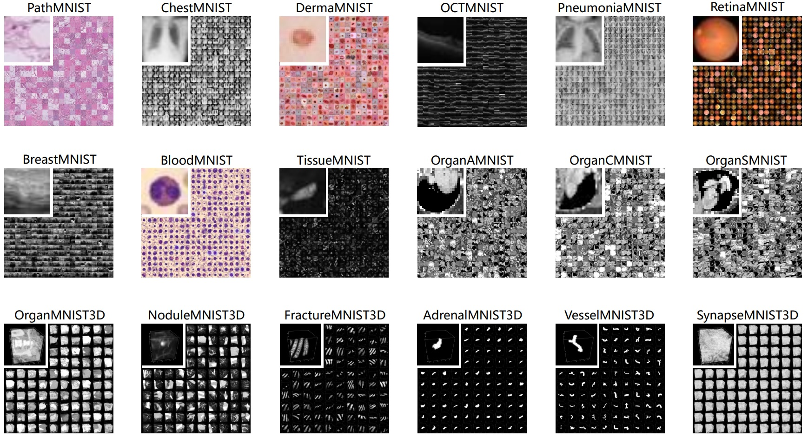
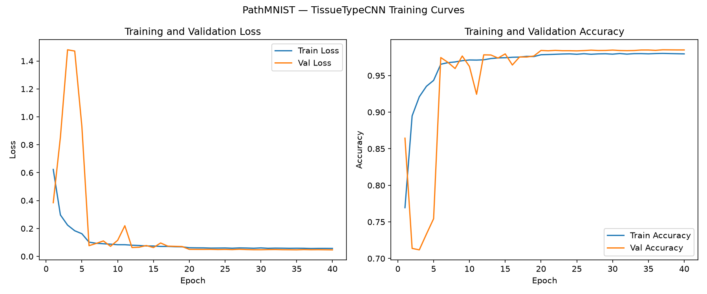
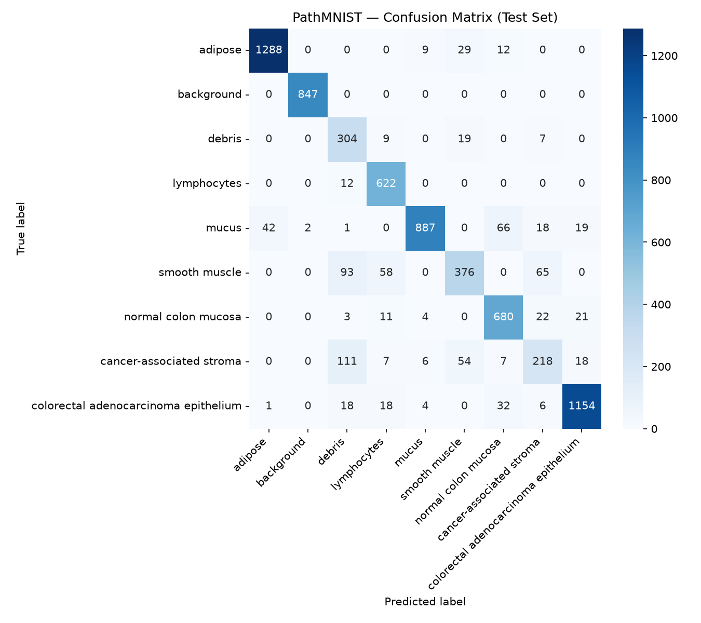

# PathMNIST



A convolutional neural network, built in PyTorch, that classifies colorectal cancer histology image patches into 9 tissue types.

**Test accuracy: 88.80%** | **Macro F1: 0.8432** - see [`results.md`](results.md) for training curves, the confusion matrix, and a full record of what was tried.

## Motivation

This project extends the MedMNIST pipeline into computational histopathology, part of a broader interest in applying machine learning to molecular and biological data. Automatic tissue-type classification from H&E-stained slides is a real building block toward tools that support pathologists in characterizing the tumor microenvironment, distinguishing tumor epithelium from stroma, immune infiltrate, and necrotic tissue.

## Dataset

- **Source:** PathMNIST, distributed via the [MedMNIST v2](https://medmnist.com/) benchmark collection (Yang et al., 2023, *Scientific Data*), built from H&E-stained colorectal cancer tissue image patches originally published by Kather et al. (2019, *PLOS Medicine*)
- **Classes (9):** adipose, background, debris, lymphocytes, mucus, smooth muscle, normal colon mucosa, cancer-associated stroma, colorectal adenocarcinoma epithelium
- **Collected from:** train and validation splits are drawn from NCT-CRC-HE-100K; the test split (CRC-VAL-HE-7K) was collected at a separate clinical center, so it reflects a genuine domain shift rather than a random held-out sample from the same source
- **Split:** 89,996 train / 10,004 val / 7,180 test (107,180 total)
- **Resolution:** 64x64 RGB
- **Class imbalance:** 1.63x between the largest class (colorectal adenocarcinoma epithelium) and smallest (normal colon mucosa), see `assets/class_distribution.png`

Per MedMNIST's own documentation, this dataset is **not intended for clinical use**.

## Architecture

A 3-layer CNN (no pretrained weights):

```
Input (3x64x64)
  -> Conv2d(3->32, k=3, pad=1) -> BatchNorm2d -> ReLU -> MaxPool(2x2)   [64->32]
  -> Conv2d(32->64, k=3, pad=1) -> BatchNorm2d -> ReLU -> MaxPool(2x2)  [32->16]
  -> Conv2d(64->128, k=3, pad=1) -> BatchNorm2d -> ReLU -> MaxPool(2x2) [16->8]
  -> Flatten (128x8x8 = 8,192)
  -> Dropout(p=0.3)
  -> Linear(8192->512) -> ReLU
  -> Linear(512->9)
```

Trained with Adam (lr=0.0005, reduced by 10x on validation-loss plateau via `ReduceLROnPlateau`, patience=3), a class-weighted cross-entropy loss (inverse-frequency weighting to correct the 1.63x imbalance), batch size 100, for 40 epochs, with random horizontal flip, vertical flip, and rotation augmentation on the training set, since histology patches have no canonical orientation. The learning rate and epoch count are lower and higher, respectively, than an earlier baseline attempt at lr=0.001 for 20 epochs, after that run showed strong validation-loss instability in its early epochs, see `results.md` for the full comparison.

The best checkpoint by validation loss is saved separately from the final epoch's weights (`saved_model.pth` versus `final_model.pth`), since validation loss did not always improve monotonically with more training. Full details in [`model.py`](model.py) and [`train.py`](train.py).

## Results

| Metric | Value |
|---|---|
| Test accuracy | **88.80%** |
| Macro F1 | 0.8432 |
| Weighted F1 | 0.8877 |
| Weakest class (cancer-associated stroma) F1 | 0.5760 |
| Strongest class (background) F1 | 0.9988 |





Six of the nine classes score above 0.88 F1. The remaining weak point is cancer-associated stroma, which is most often confused with debris; debris more broadly absorbs stray misclassifications from several other classes rather than being paired one-to-one with a single confusable class. Visual inspection of the misclassified stroma examples did not reveal an obvious staining or contrast artifact, so this is documented as an open, unresolved limitation rather than something attributed to a specific fixable cause. Full experiment history, including a resolved instability issue and this unresolved one, is in [`results.md`](results.md).

## Limitations

Per MedMNIST's own documentation, **this dataset is not intended for clinical use**, and this model is not validated for any diagnostic purpose. Because the test split was collected at a different clinical center than the training and validation data, test accuracy is expected to run below validation accuracy for any model trained on this benchmark. That gap is a structural property of the dataset, not a defect specific to this model, but it does mean validation metrics alone should not be used to judge real-world performance. The unresolved cancer-associated stroma and debris confusion would matter in a real diagnostic context, since tumor stroma and necrotic tissue are clinically distinct findings. No bias or fairness analysis has been performed across additional patient populations, scanners, or staining protocols beyond the single train-to-test domain shift already documented.

## Setup

```
git clone https://github.com/jenniferestigene/pathmnist.git
cd pathmnist
python3 -m venv venv
source venv/bin/activate        # <- Mac, Windows -> : venv\Scripts\activate
pip install -r requirements.txt
```

PathMNIST downloads automatically via the `medmnist` package on first run, no manual dataset download needed.

## Usage

```
python dataset.py                        # builds .npy tensors + assets/class_distribution.png
python train.py                          # trains the model, saves saved_model.pth, final_model.pth + training_log.csv
python visualize_training.py             # builds assets/training_curves.png from the training log
python evaluate.py                       # evaluates on the test set, builds assets/confusion_matrix.png + classification_report.txt
python visualize_misclassifications.py   # saves side-by-side comparison grids for a specified confusion pair
```

`train.py` automatically uses a GPU if one is available (`torch.cuda.is_available()`), and falls back to CPU otherwise, the same code runs unmodified locally or on a GPU-backed environment like Google Colab.

## Future Work

- **Stain-robustness augmentation (ColorJitter)**, to test whether it further narrows the train-to-test domain gap, independent of the training-schedule fix that already resolved the earlier adipose and smooth-muscle confusion
- **Deeper investigation of the cancer-associated stroma and debris confusion**, potentially through embedding-space analysis rather than visual inspection alone, since visual comparison did not surface an obvious cause
- **A deeper architecture with residual connections**, to see whether additional model capacity closes more of the remaining gap to published ResNet-18 baselines on this benchmark
- **Test-time augmentation**, as a low-cost accuracy boost that does not require retraining

## Repository structure

```
pathmnist/
├── assets/
│   ├── class_distribution.png
│   ├── training_curves.png
│   ├── confusion_matrix.png
│   ├── misclassified_cancer-associated_stroma_as_debris.png
│   ├── correct_cancer-associated_stroma.png
│   └── correct_debris.png
├── README.md
├── classification_report.txt
├── dataset.py                          # raw images -> .npy tensors + class_distribution.png
├── evaluate.py                         # evaluation + per-class metrics + confusion matrix
├── model.py                            # CNN architecture (nn.Module)
├── requirements.txt
├── train.py                            # training loop, weighted loss, LR scheduler, checkpointing, writes training_log.csv
├── training_log.csv                    # metrics from the reported run
├── results.md                          # training curves, metrics, full experiment log
├── visualize_training.py               # builds training_curves.png from the log
└── visualize_misclassifications.py     # side-by-side comparison grids for a given confusion pair
```