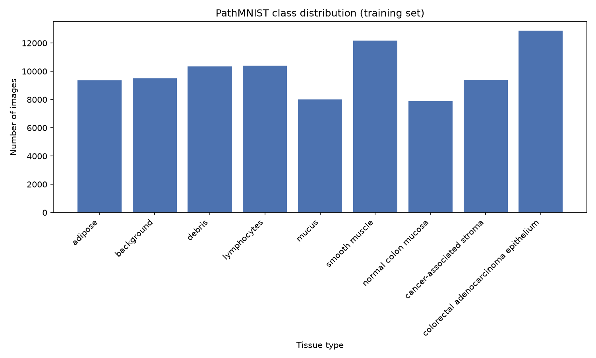

# Results

## Final metrics (64x64, weighted loss, lr=0.0005, LR scheduler, 40 epochs)

| Class | Precision | Recall | F1 | Support |
|---|---|---|---|---|
| adipose | 0.9677 | 0.9626 | 0.9652 | 1338 |
| background | 0.9976 | 1.0000 | 0.9988 | 847 |
| debris | 0.5609 | 0.8968 | 0.6901 | 339 |
| lymphocytes | 0.8579 | 0.9811 | 0.9154 | 634 |
| mucus | 0.9747 | 0.8570 | 0.9121 | 1035 |
| smooth muscle | 0.7866 | 0.6351 | 0.7028 | 592 |
| normal colon mucosa | 0.8532 | 0.9177 | 0.8843 | 741 |
| cancer-associated stroma | 0.6488 | 0.5178 | 0.5760 | 421 |
| colorectal adenocarcinoma epithelium | 0.9521 | 0.9359 | 0.9440 | 1233 |
| **accuracy** | | | **0.8880** | 7180 |
| macro avg | 0.8444 | 0.8560 | 0.8432 | 7180 |
| weighted avg | 0.8952 | 0.8880 | 0.8877 | 7180 |

## Training curves

The learning rate scheduler (`ReduceLROnPlateau`, patience=3, factor=0.1) triggered twice: once around epoch 4-5 and again around epoch 18-19. After the first drop, validation loss fell sharply and epoch-to-epoch noise was largely eliminated. The last roughly 20 epochs are essentially flat on both loss and accuracy, indicating the model had converged rather than being cut off early. The best checkpoint by validation loss landed at epoch 40 in this run, the final epoch, unlike earlier runs, since by that point the learning rate had dropped to near zero and the model was only inching downward rather than overfitting past a peak.

## Confusion matrix

The diagonal is dominant for most classes. The main residual confusion is cancer-associated stroma, which is predicted as debris in roughly a quarter of its test images, and debris more broadly, which absorbs stray misclassifications from several other classes (smooth muscle, mucus, normal colon mucosa, colorectal adenocarcinoma epithelium) rather than being confused with just one specific class. This is a different pattern from the earlier adipose and smooth muscle confusion described below, which was one-directional between exactly two classes.

## Class distribution

1.63x imbalance between the largest class (colorectal adenocarcinoma epithelium, 12,885 images) and smallest (normal colon mucosa, 7,886 images) in the training set. This motivated the inverse-frequency class weighting used in the final loss function (see `compute_class_weights()` in `train.py`), though the imbalance here is considerably milder than BloodMNIST's 2.74x.

## What was tried

**1. Baseline pipeline (lr=0.001, weighted loss, 20 epochs, no best-checkpoint saving).**
Established the full dataset, model, train, and evaluate pipeline at 64x64 resolution, reusing the BloodMNIST architecture and resolution choice directly rather than re-testing 28x28. Along the way, a real bug was caught: `train.py` saved only the final epoch's weights unconditionally, rather than tracking the best validation loss across epochs. Because validation loss was highly volatile early in training (ranging as high as 3.73 while lr=0.001), the final epoch was not reliably the best-performing one. Fixed by adding checkpoint logic that saves `saved_model.pth` only when validation loss improves, with the final epoch's weights saved separately to `final_model.pth` for comparison.

**2. Re-run with checkpoint fix (lr=0.001, weighted loss, 20 epochs).**
With checkpointing in place, the best epoch (17, validation loss 0.0419, validation accuracy 0.9877) was correctly selected instead of the worse final epoch (20, validation accuracy 0.9765). Evaluated on the held-out test set (CRC-VAL-HE-7K, collected at a different clinical center than train and validation): **79.96% test accuracy**, notably lower than the roughly 98% validation accuracy, consistent with the known train and test domain shift built into this benchmark.

The confusion matrix showed one dominant, one-directional error: 502 of 1,338 adipose test images misclassified as smooth muscle, accounting for about 35% of all test-set errors. Visual inspection (`visualize_misclassifications.py`) of the misclassified adipose images did not show an obvious staining or color shift; the images retained adipose's characteristic honeycomb membrane structure. The training log showed validation loss oscillating wildly, between roughly 0.18 and 3.73, for the first 13 epochs at lr=0.001, before the scheduler's first drop stabilized training, pointing toward training instability rather than a genuine visual or architectural limitation as the likely cause.

**3. Lowered learning rate and extended training (lr=0.0005, weighted loss, 40 epochs).**
Tested whether the early instability from experiment 2, rather than a genuine data or architecture limitation, explained the adipose and smooth muscle confusion. Lowered the initial learning rate and doubled the epoch budget to give the model more time in the stable, low-lr regime. Result: **88.80% test accuracy**, an 8.8 point improvement over experiment 2 with no change to the architecture, loss function, or augmentation pipeline. Training stabilized by epoch 5, compared to epoch 13 previously, and the last roughly 20 epochs were essentially flat. The adipose and smooth muscle confusion mostly resolved: adipose recall rose from 0.62 to 0.96, and that specific misclassification dropped from 502 to 29 images. This confirmed that the earlier instability, not a fundamental visual or architectural limitation, was the primary driver of the low baseline accuracy.

**4. Investigated the new dominant confusion (cancer-associated stroma predicted as debris).**
With the adipose issue resolved, cancer-associated stroma became the weakest class (precision 0.6488, recall 0.5178), with debris absorbing misclassifications from several classes rather than one specific confusable pair. Visual inspection of misclassified stroma examples did not reveal an obvious pattern: the misclassified images looked like ordinary cancer-associated stroma, similar in color and texture to the correctly classified examples, not like debris. Since the training curve for experiment 3 was already flat over its last 20 epochs, this was not attributed to undertraining either. Left as a documented, unresolved limitation, possibly reflecting a genuinely difficult decision boundary in the model's learned feature space, or label ambiguity in tissue patches near class boundaries in the source dataset, rather than pursued further.

## Known limitations

- Per MedMNIST's own documentation, this dataset is not intended for clinical use, and this model has not been validated for any clinical or diagnostic purpose.
- The test split was collected at a different clinical center than the train and validation splits. This is a deliberate property of the benchmark, but it means the roughly 98% validation accuracy seen during training substantially overstates real-world performance; the 88.80% test accuracy is the number that should be reported.
- The cancer-associated stroma and debris confusion remains unresolved. While smaller in scale than the earlier adipose and smooth muscle confusion, it would matter in a real diagnostic context, since tumor stroma and necrotic or debris tissue are clinically distinct findings.
- No bias or fairness analysis has been performed across additional patient populations, scanners, or staining protocols beyond the single train-to-test domain shift already documented.